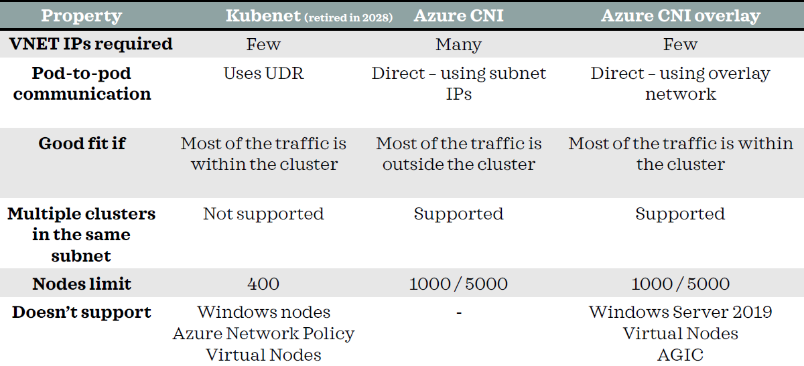

--------------------------------------------------------------------------------------------------

1. Create aks cluster using azure cli
    az aks create -g aks-rg -n aks-cluster-demo -c 2                                    #  -c denotes the node count

2. Configure access to AKS cluster from your local machine
    az aks get-credentials  -g aks-rg -n aks-cluster-demo                               # This command downloads the kubeconfig file for the aks cluster and merges it with the local ~/.kube/config file on your machine. This config file contains information n
3. Reconcile  the updates to an existing kubernetes cluster
    az aks update -g aks-rg -n aks-cluster-demo                                         # The command az aks update -g aks-rg -n aks-cluster-demo is used to update an existing Azure Kubernetes Service (AKS) cluster.
    
4. The NRGLockdown feature in Azure Kubernetes Service (AKS) is designed to enhance the security and stability of your AKS clusters by          restricting modifications to the node resource group. Here’s a brief overview:
    • Node Resource Group Lockdown: This feature prevents users from making changes directly to the resources in the node resource group, which can affect cluster operations or cause future issues. Instead, changes should be made through the Kubernetes API.
    • Deny Assignment: By applying a deny assignment, it blocks users from modifying resources created as part of the AKS cluster.
    • Preview Feature: Currently, NRGLockdown is available as a preview feature, meaning it’s not yet fully supported for production use and is provided on a best-effort basis.
    To enable this feature, you need to register the NRGLockdownPreview feature flag and update your AKS cluster configuration accordingly 
    az aks update -g aks-rg -n aks-cluster-demo --nrg-lockdown-restriction-level ReadOnly

5. Command to list all the contexts in your Kubernetes configuration file:
    Kubectl config get-contexts                             # This command will display a table with the available contexts, showing details like the current context, cluster, and user.
    
    Related Commands:
    Kubectl config current-context                          # display the current context in the kubernetes configuration

    Kubectl config use-context <<context-name>              # command to switch to a different context in the available kubernetes configuration.

6. Azure CNI Overlay
    IP Assignment: Pods receive IP addresses from a private CIDR range that is logically separate from the VNet hosting the nodes.
    Network Traffic: Pod and node traffic within the cluster use an overlay network. Network Address Translation (NAT) is used for communication outside the cluster.
    Scalability: This model conserves VNet IP addresses, making it suitable for large-scale clusters.
    
    Use Case: Ideal for scenarios where you need to scale your cluster significantly without exhausting VNet IP addresses. It’s also useful when you want to reuse the private CIDR in different AKS clusters.

   Azure CNI Subnet
    IP Assignment: Pods receive IP addresses directly from the VNet subnet.
    Network Traffic: Direct routing is used for pod-to-pod and pod-to-VNet communication, providing lower latency compared to overlay.
    Scalability: This model can lead to IP exhaustion in large clusters as it consumes VNet IP addresses.
    
    Use Case: Best for enterprise-grade workloads that require direct pod-to-resource connectivity within the VNet. It’s suitable for smaller clusters or environments where IP address management is not a concern.
    
    When to Choose Which?
        Choose Azure CNI Overlay if you need to conserve VNet IP addresses and plan to scale your cluster to a large size. It’s also beneficial if you want to reuse IP ranges across multiple clusters.
        
        Choose Azure CNI Subnet if you require direct connectivity between pods and other resources within the VNet, and you have sufficient IP address space in your VNet.

